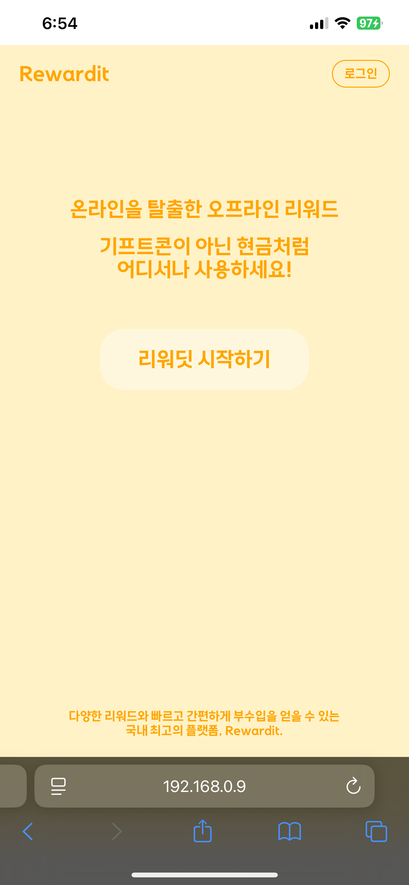

# 리워딧(Rewardit) - 리워드 플랫폼

> 일상속의 현명한 소비를 도와주는 Rewardit  
> 온라인을 넘어 오프라인에서도 사용 가능한 **즉시 리워드 서비스**  
> Vue.js 기반의 반응형 웹앱으로, 사용자/사장님/관리자 모두가 모바일에서도 쉽게 사용할 수 있는 UI를 제공합니다.

## 📱 프로젝트 소개

> 사용자는 참여형 광고, 30초 광고, SNS 구독 광고를 통해 리워드를 적립할 수 있습니다.  
> 리워드 포인트는 QR 코드를 통해 협약된 사업장에서 현금처럼 사용할 수 있는 **참여형 리워드 플랫폼**입니다.    
> 사업장 사장님은 사용자가 사용한 포인트를 관리자에게 요청해 현금으로 환급 받을 수 있습니다.  
> 관리자는 사업장의 사장님들을 관리할 수 있습니다.

### 🧩 주요 기능

- **사용자 페이지**
    - 광고 참여 (클릭형, 영상형, SNS형)
    - 포인트 적립 및 내역 확인
    - QR을 통한 리워드 교환
    - 마이페이지에서 포인트 내역 확인 및 교환 요청

- **사장님 페이지**
    - 사용자 리워드 요청 확인 및 승인 처리
    - 월별 요청 내역 확인

- **관리자 페이지**
    - 전체 회원, 지급 현황 집계
    - 각 가맹점 정보 확인
    - 채굴 포인트 및 지급 금액 모니터링

---

## 📱 주요 화면

### ▶️ 메인 페이지

- 방문자를 위한 서비스 소개 및 시작 유도 화면  
  

---

### 📋 로그인

- 간편로그인(구글로그인) 및 최조 로그인시 약관 동의 화면

  
  

---

### 📋 사용자 홈

- 다양한 광고 참여형 리워드 제공
- 광고 클릭 시 설명/조건을 모달로 확인 가능

    
  
  

---

### 👤 마이페이지

- 적립 내역 확인 / QR 교환 요청 / 승인 이력 확인 가능
- 사용자에게 직관적인 리워드 흐름 제공

**탭 구성 / 적립 내역 / 교환 요청 / QR 사용 예시**

    
    
    
  

---

### 🧑‍🍳 사장님 페이지

- JWT 토큰을 통한 로그인 방법 구현
- 요청된 포인트 지급 내역 확인
- "승인하기" 버튼으로 포인트 사용 승인

  
  

---

### 🛠 관리자 페이지

- 전체 가맹점, 회원, 지급 포인트 통계를 한눈에 확인
- 개별 가맹점 정보도 상세 조회 가능

---

### 🛠️ 기술 스택

| 구분           | 기술                          | 설명                                 |
|--------------|-----------------------------|------------------------------------|
| **프레임워크**    | `Vue.js 3`                  | 컴포지션 API 기반의 최신 Vue 프레임워크          |
| **개발 환경**    | `Vite`                      | 빠른 번들링과 HMR(핫 모듈 리플레이스먼트) 지원       |
| **스타일링**     | `SCSS`                      | 변수, 믹스인, 중첩 등을 활용한 유지보수 쉬운 스타일링    |
| **UI 라이브러리** | `Vuetify`                   | Vue 기반의 Material Design 컴포넌트 프레임워크 |
| **상태 관리**    | `Vuex`                      | 중앙 집중형 상태 관리 라이브러리                 |
| **기타**       | `HTML`, `JavaScript (ES6+)` | 마크업 및 동적 로직 구현에 사용                 |
